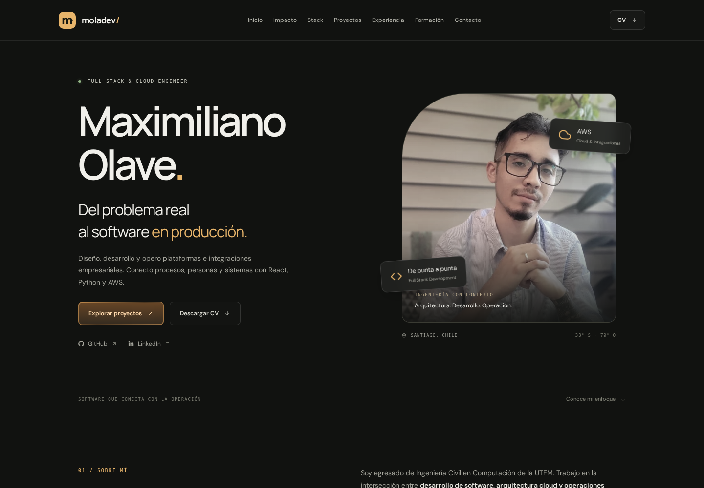

# Moladev — Portafolio 2026

Portafolio de Maximiliano Olave, Full Stack & Cloud Engineer, con experiencia en AWS, plataformas operacionales e integraciones ERP/WMS. Contenido actualizado con el CV 2026 y el análisis de brechas de septiembre de 2026.

## Desarrollo local

Requiere Node.js 22.12+ o una versión compatible más reciente, y npm.

```bash
npm ci
npm run dev
npm run lint
npm run build
npm run preview
```

`dev` sirve el sitio en `http://localhost:5173`. `preview` permite revisar el build en `http://localhost:4173`. El workflow `.github/workflows/ci.yml` ejecuta lint y build para pull requests y cambios en main/master; no despliega.

## Rutas

- `/`: perfil, impacto, stack, proyectos, experiencia, formación y contacto.
- `/proyectos/plataforma-sc`: caso de producto, módulos, arquitectura, capturas y CI/CD.
- `/proyectos/integracion-wms-erp`: arquitectura AWS, flujos, observabilidad, integridad y decisiones técnicas.
- Las rutas desconocidas muestran una página 404 dentro de la SPA.

React 19, TypeScript, React Router, Vite, Tailwind CSS 4, CSS y Framer Motion. Componentes visuales de Kokonut UI adaptados al diseño; no se agregó una segunda librería de animación.

## Diseño e interacción

Paleta carbón/oliva con acento ámbar, tipografía Manrope y DM Sans servida localmente en WOFF2 (licencias OFL en `public/fonts`). Las tarjetas adaptan [Spotlight Cards](https://kokonutui.com/docs/cards/spotlight-cards) y los CTA adaptan [Gradient Button](https://kokonutui.com/r/gradient-button.json), ambos de Kokonut UI por dorianbaffier. Licencia MIT conservada en [docs/KOKONUT-LICENSE.txt](docs/KOKONUT-LICENSE.txt).

La adaptación reduce la inclinación a 2°, evita oscurecer tarjetas vecinas, limita transiciones de interacción a 160–200 ms y respeta `prefers-reduced-motion`. Las entradas se reproducen una vez. El menú móvil dispone de Escape y acceso al CV. El visor de imágenes usa un diálogo modal, cierre con Escape, foco contenido y retorno al control que lo abrió.

## Contenido y recursos

- Enlaces profesionales y CV centralizados en `src/data/profile.ts`.
- CV nuevo: `public/Maximiliano_Olave_CV_2026_Actualizado.pdf`.
- La ruta anterior `Maximiliano Olave CV.pdf` conserva una copia idéntica por compatibilidad.
- Estado académico: **egresado, trabajo de título / defensa en proceso**.
- DynamoDB/PERSIST se describe como validación/evolución, sin afirmar cierre productivo E2E.
- Las capturas seleccionadas corresponden a referencias de 2025; los esquemas de arquitectura son conceptuales.
- `scripts/prepare-public.mjs` copia únicamente una lista explícita de recursos revisados a `node_modules/.cache/portfolio-public`. Vite sirve y construye desde esa carpeta. Los archivos originales de referencia permanecen en `public`, pero los no seleccionados no se incluyen en el sitio. Para añadir recursos, actualizar la lista y reiniciar `npm run dev`.
- No se incluyen credenciales, endpoints internos ni datos de transacciones en los diagramas nuevos.

## SEO y publicación

Idioma español, meta description, canonical, Open Graph, Twitter Card, JSON-LD Person, imagen social, sitemap y robots. Los títulos, descripciones y canonical cambian al navegar entre proyectos. Las rutas son client-side: los crawlers que no ejecutan JavaScript reciben las etiquetas generales de `index.html`; un prerender por ruta queda como mejora futura.

`vercel.json` mantiene el fallback de React Router. Sitio de referencia: https://portafolio-moladev.vercel.app/. Cambiar `profile.site`, las etiquetas de `index.html`, `robots.txt` y `sitemap.xml` si se cambia de dominio. Esta actualización es local y no incluye publicación.

## Pendientes editoriales

- Max Planner: el repositorio `4poloo/max-planner` respondió 404 sin autenticación; no se agregó un enlace o estado público no verificado.
- Capturas 2026 de los módulos operacionales: incorporar cuando exista material actualizado y anonimizado.
- Inglés, analytics y dominio propio son mejoras opcionales posteriores.

El detalle de validación local está en [docs/VALIDACION-2026.md](docs/VALIDACION-2026.md).


